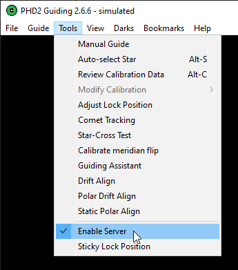

## Overview

Dithering is an important part of the modern image acquisition process. CMOS and CCD sensors suffer from various types of electronic noise, such as fixed-pattern noise, and defects such hot and cold pixels. Photons of light from stellar objects fall onto the sensor and will effectively be lost if the photon falls on a dead or hot pixel. The act of dithering is a commanded move of the mount between successive exposures that very slightly alters, on the pixel scale, where photons fall on the sensor. This means that one exposure can capture light (ie, data) from an object where that same light fell on a dead or hot pixel in the previous exposure. Image alignment issues are easily handled by most astronomy stacking and image post-processing applications.

Because dithering is an operation that must be coordinated with guiding (remember, the mount is being purposefully moved, albeit a few pixels in a direction, which guiding would reflexively try to counteract), the dithering operation is managed by PHD2 itself. N.I.N.A. just commmands PDH2 to execute a dither operation, and PHD2 informs N.I.N.A. with the operation is complete. Any required adjustments to guiding are automatically handled by PHD2. N.I.N.A. then resumes commanding normal exposures.

## Requirements

N.I.N.A. supports dithering using its direct communication with PHD2 and makes it easy to set up as a part of a sequence. There are a few prerequisites to dither during a sequence:

 * A mount needs to be connected
 * PHD2 needs to be be running, actively guiding, and also communicating with N.I.N.A.
 * The PHD2-related settings in the Equipment Settings need to be correctly set up
 * Dithering needs to be enabled in the sequence

## PHD2 Settings

In order for N.I.N.A. to communicate with PHD2 and command operations such as dithering and for receiving guiding telemetry, PHD2's internal server must be enabled. To enable PHD2's internal server, go to PHD2's **Tools** menu and ensure that **Enable Server** is selected.

## N.I.N.A Settings

### Settings for PHD2

Settings related to guiding and dithering can be found in the **Options > Equipment** tab. The defaults are suitable for most cases. You will need to specify the full path to `phd2.exe` if PHD2 was installed in a non-standard location. This is so N.I.N.A. can automatically start PHD2 as a part of the equipment connection process.

An explanation of the two most important dithering-related settings follows:

 * **PHD2 Dither Pixels**: The amount of pixels (on the guiding camera) that the dithering action will shift. The default works fine for most focal lengths. This value must take into account the focal length of your guiding optical train and the pixel size of your guide camera's sensor, also known as the pixel scale. Obviously, 2 pixels at one focal length and pixel size will cover a different amount of sky than another setup with a different focal length and pixel size.
 * **Dither RA Only**: Turn on if your mount has large amounts of declination backlash. This will cause dithering to happen on the RA axis only and allow the declination axis to continue guiding.

!!! tip
    The pixel scale of your guide camera can be calculated using online tools. By inputting the focal length of your guiding optical train and the pixel size of your guide camera's sensor, you will know how many arcseconds of sky is covered by each pixel (arcseconds per pixel). Such a tool is the [Astronomy Tools FOV Calculator](//astronomy.tools/calculators/field_of_view/).

### Settings in Sequences

Initiating dithering during the course of a running sequence is simple. Dithering operations can be activated for each step in a sequence, and be initiated every *Nth* frame in each step. That is, if a step in a sequence specifies that 20 exposures be taken with a dither operation every second exposure, two normal exposures will be taken, a dither operation performed, and then the next two exposures will be taken, etcetera. N.I.N.A. manages these operations itself in conjunction with PHD2 and the process is entirely hands-off.

Dithering operations happen while the previous image is downloading from the camera. If you have a camera with slow download speeds, it might be that the dithering operation is completed in time for the camera to be ready for the next exposure.

!!! tip
    If you use a LRGB rotational sequence (See Also: [Advanced Sequencing](advancedsequence.md)) you might only want to dither on every L frame. If an OSC or DSLR camera is used, it is suggested to dither after every frame.