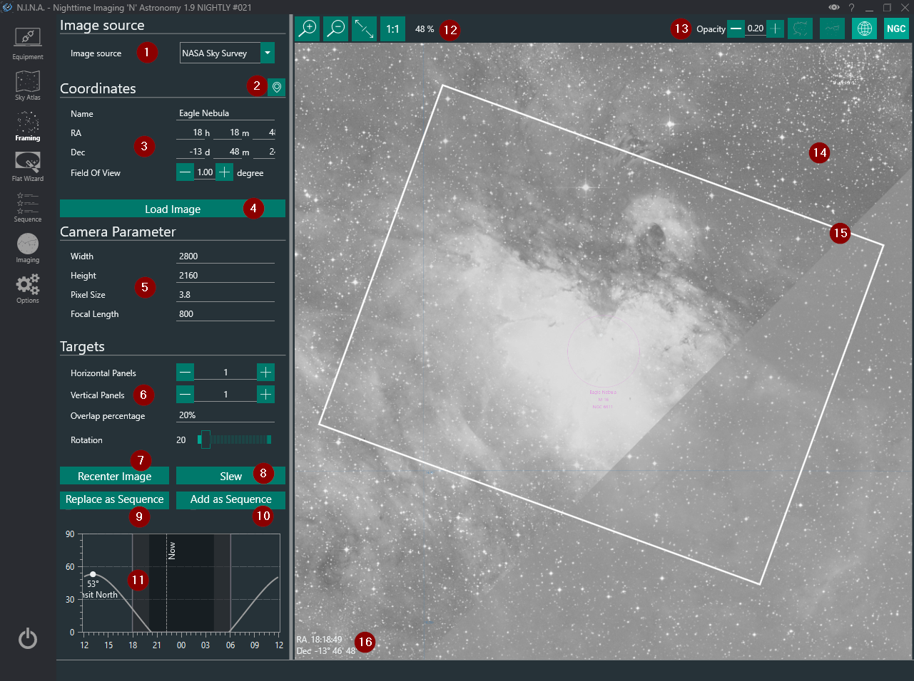

Framing Assistant allows you to frame the next shot perfectly via several online sourced survey images, an inbuilt planetarium, or user supplied image. It can utilize plate solving to perfectly align your telescope to match the position of the framing rectangle.

For further information about using the Framing Asisstant refer to (Link here)

1. **Image Source Drop Down**
  * Allows you to change the image source 
  * Possible options are 
    * Digital Sky Survey: requires an internet connection to download the data 
    * SkyAtlas: An offline planetarium that displays circles representing approximate target sizes 
    * From File: can load in a jpg, gif, png or tif file 
    * Cache: utilizes the local cache 
  * Successfully solved local and survey images are cached 
  * From File will utilize the Blind Solver to determine the coordinates and it can take a while 

2. **Planetarium Sync Button**
 * This grabs coordinates from a external planetarium program (i.e. stellarium) 

3. **Coordinates**
  * You can set the name, RA and Dec coordinates here as well as the field of view in degrees 
  * RA, Dec and field of view are unavailable when loading from file 
    > Fields will be populated once the image has been solved 

4. **Load Image**
  * Starts the image download when using a survey 
  * Starts the plate solving mechanism when using from file 
  * Tries to load the coordinates from cache 

5. **Width, Height, Pixel Size and Focal Length**
  * Values will be set from a connected camera automatically if available 
  * Not available for DSLR users 
  * Focal length is not synchronized to the Settings page > This allows you to play around with various focal lengths to check your framing 
  * These parameters determine the size of the framing rectangle (15) 

6. **Mosaic Panels and rotation**
  * Rotation can be set freely and should match your cameras orientation as determined by plate solving 
  * You can specify the number of panels for an N x M size mosaic 
  * You can specify the % overlap between each panel 

7. **Recenter Image**
  * When using a survey source, redownloads an image of the region centered on the current coordinates set by the framing rectangle (15) 
  * When using cached images or file source, the framing rectangle is centered on the image center 

8. **Slew**
  * Slews the mount exactly to the coordinates of the center of the framing rectangle (16) 

9. **Replace as Sequence**
  * Sets the coordinates of the RA and Dec of the framing window as the sequence and copies the name over to the sequence tab as well 
  * Replacing the target also resets sequence settings to default 

10. **Add as Sequence**
  * The same as (9) but the framed target is added as a new sequence target and tab, this does not affect the current sequence 

11. **Altitude browser**
  * Displays the altitude of the target over time, indicating current position and meridian 

12. **Image display controls**
  * From left to right: Zoom in, zoom out, fit image to screen, show image in original resolution 

13. **Annotation controls**
  * From left to right: Opacity of framing rectangle, constellation boundaries, constellation annotation, equatorial grid, annotate DSOs 

14. **Image**
  * The image as downloaded from the survey, cache, skyatlas or  loaded file 

15. **Framing rectangle**
  * Depends on the camera and focal length parameters (5) 
  * Can be dragged around with the mouse 
  * Can be rotated with (6) 
 
16. **RA/DEC Coordinates**
  * The coordinates of the center of the framing rectangle. These are used as a sequences target coordinates  