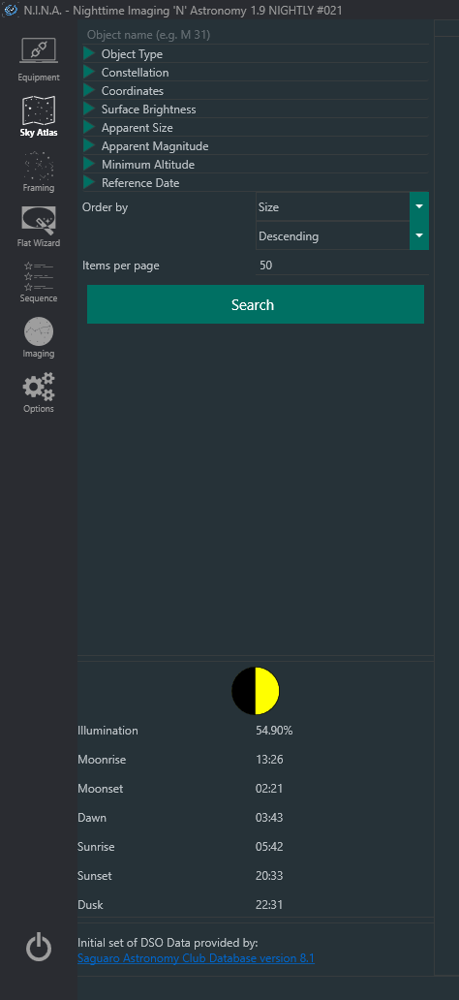
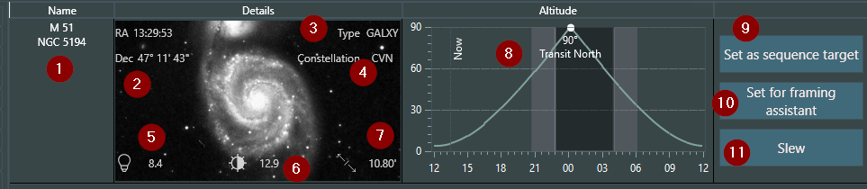

## Overview

The Object Browser allows for easy planning of targets to photograph. It seamlessly interfaces with both the Framing Assistant and Sequence manager.

The Object Browser shows allows you to search for targets that are relevant. Filters can be set for the object type or maximum altitude. Should you have not decided yet what you want to shoot following filters are suggested to use:

 * Object Type: select the kind of object(s) you would like to photograph.
 * Constellation: show objects that reside within a specific constellation.
 * Coordinates: show objects that reside within a range bounded by a specified RA and declination.
 * Surface Brightness: show objects that fit in a range of surface brightness.
 * Apparent Size: show objects that fit within a range of apparent sizes.
 * Apparent Magnitide: show objects that fit within a range of magnitudes
 * Minimum Altitude: Generally, it is unadvisable to photograph anything that is below 45 degrees due to atmospheric distortion.

Search results may be ordered by various criteria in ascending or descending order. Preview-quality images of the objects listed in the search results may be displayed if the optional SkyAtlas data pack is downloaded and installed.

Below the Search panel is information about the current phase of the Moon, Sun and Moon rise and set times, as well as the beginning of "astro dark" - when Civil Twilight ends and influences of the Sun's daytime light is no longer a consideration.

!!! important
    Utilizing the Object Browser requires your current location information to be set in the Astrometry settings area in the general settings. No doing so, or inputting inacurate information with will cause Object Browser to display inaccurate data!

## Object Browser Display

All objects in the Object Browser are displayed in the same manner. Once the display layout is understood, it becomes very easy and tremendeously helpful tool for to determine whether a target is or will be in a position condusive to photographing.

An example of a search result:

1. The name of the object in question with any available alternatives. Spoken names like "Whirlpool Galaxy" are not yet implemented
2. The Coordinates of the object in RA and Dec, should you want to save the coordinates or manually slew to them
3. The object type. Types are abbreviations to conserve visual space. The filter uses the full type name instead of the abbreviation
4. The object's constellation, abbreviated
5. Apparent magnitude of the object, if available. This determines the peak brightness
6. Surface brightness of the object, if available. The actual full brightness of the object. A value of 99.9 indicates an unknown surface brightness
7. Apparent size of the object, if available. Shows you the apparent size in arcminutes or degrees, depending on size.
8. The altitude of the object, current time and darkness meter.
    * This one is a bit more complex to explain; the line with a specific peak is the actual altitude of the object at any given time, generally: the higher, the better. Transit north or south tells you whether the object will pass to your south or north.
    * The Now line shows you your current time so you can crossreference the current altitude of the object.
    * The darker lines are show you the start of the nautical and astro dark.
9. Sets the object as the target for the Sequence, see Usage: Advanced sequencing
10. Sets the object as the target for the Framing Assistant, see Usage: Framing with the Framing Assistant