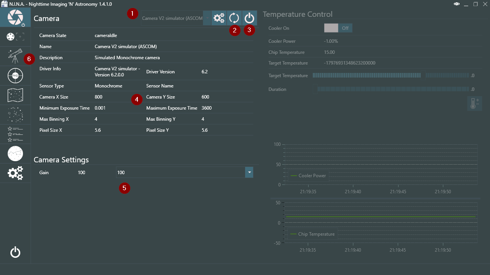
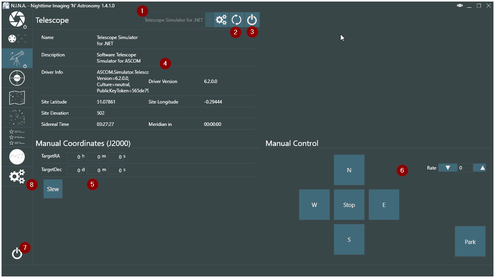

Now let us focus on connecting your camera and mount for the first time.

!!! note
    You should have physically connected your camera and mount to the PC N.I.N.A. is running on already. If you did not, connect it now.

Now you need to select your camera in the drop down menu (1). If it does not appear in the list press the refresh button (2). If you are using a Nikon camera you need to select the general "Nikon" option from the drop down menu. Once you selected your camera press the Connect button (3) to connect the device.

Once your device is connected it will display various information about the camera (if available) in the Camera section (4).

!!! note
    Keep in mind that if you are using a DSLR the information might be incomplete or missing. That doesn't deter N.I.N.A. from working, but should you need to find the information you have to look for it online.

When you connect a camera that has the ability to change the gain (ISO) it will be displayed in the Camera Settings section (5). This is the default gain that will be used and can be overridden by settings during imaging later.

Once you connected your camera you will need to connect your mount. For that we have to switch to the telescope tab (6).

Here we have the same procedure to connect the mount as we have with the camera. Select the mount from the dropdown (1), refresh if not available (2), and press connect (3) to connect to the mount.

In the Telescope section (4) you will find useful information about the latitude, longitude, elevation, sidereal time and when it will arrive at the meridian as saved in the driver/mount or calculated by N.I.N.A.. You can manually slew to specific coordinates with (5) or control the mount manually in the Manual Control section (6). This is very useful if you don not use a hand controller with your mount.