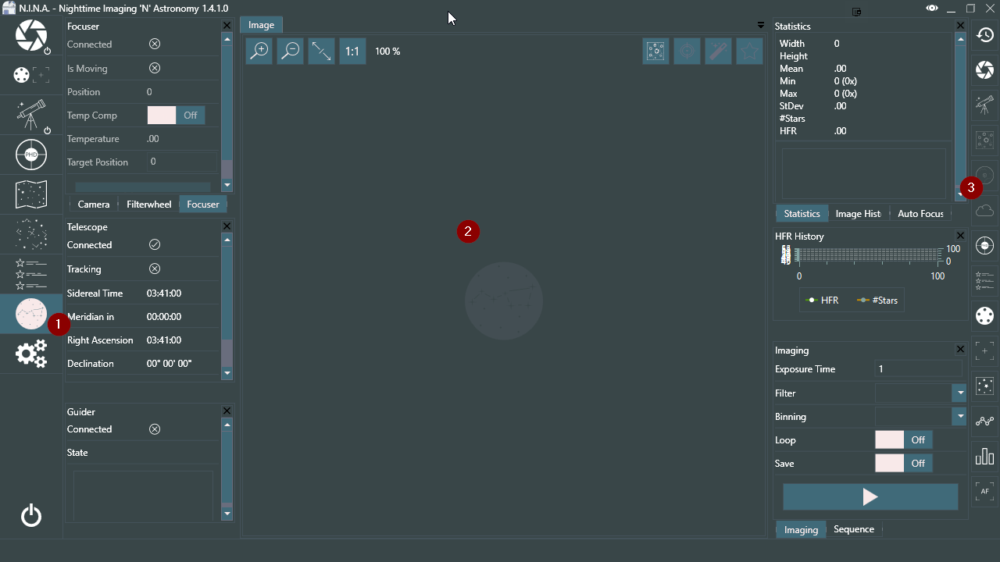
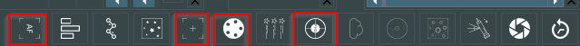
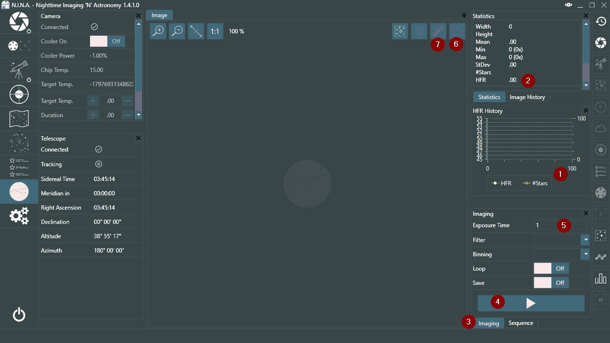
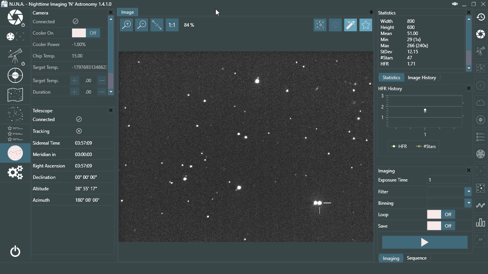
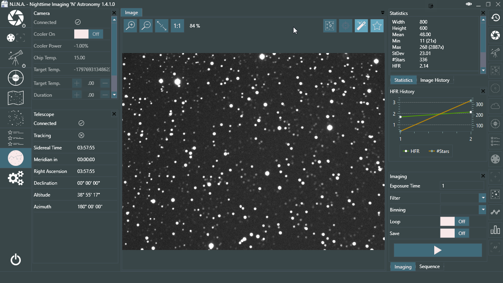

To start imaging you first want to focus. For that, let's switch to the Imaging tab (1).

Once there, you will be greeted with this view. There is a lot of information and panels around, but in general it's divided in two spaces. First, where you can view and interact with the panels (2) and a second where you can enable and disable various panels (3). Since we only use a DSLR and a mount let us disable disable a lot of those panels to get a better overview. Feel free to enable and disable your panels at will, in this example I will disable the following panels by clicking on their icon:

You can leave those panels enabled, or disable any other at your will. Feel free to experiment around to see what you like. You can also drag the panels around inside the imaging window and rearrange and customize your look and feel. For tutorial reasons, I will leave that be for now.

Since our target now is to focus our telescope to get pinpoint stars, we have to use the the following currently enabled panels.

!!! tip
    An alternative to focus is to use a Bahtinov Mask. You can try our experimental feature for Bahtinov Detection by enabling the icon in the Image panel.

With the HFR History (1) you will be able to see how your stars perform in terms of HFR. This is also represented in the Statistics panel (2). The lower your HFR value, the better focused your image will be. To start the manual focus procedure, you have to select the Imaging tab (3) and press on the start capture button (4). Your exposure time for that snapshot can be adjusted as well, should you choose to do so (5).

To enable star detection and HFR analysis, you need to press on the Star Analysis button (6). This will yield a full analysis of the image and will enter the HFR values in the Statistics (2) and HFR History (1). You will notice that the AutoStretch button (7) will be enabled as well once you enable the Star Analysis button (6).

Here are two examples of a focused and defocused star field.

As you can see, the values for HFR have been entered in the HFR history and are displayed in the Statistics as well. The second image is definitely defocused with a HFR of 2.14, while the first image is in as good focus as possible. Your HFR values will vary because they depend on the focal length of the telescope as well as on the pixel size of the sensor, but you should try and focus your telescope until the HFR is as low as possible.