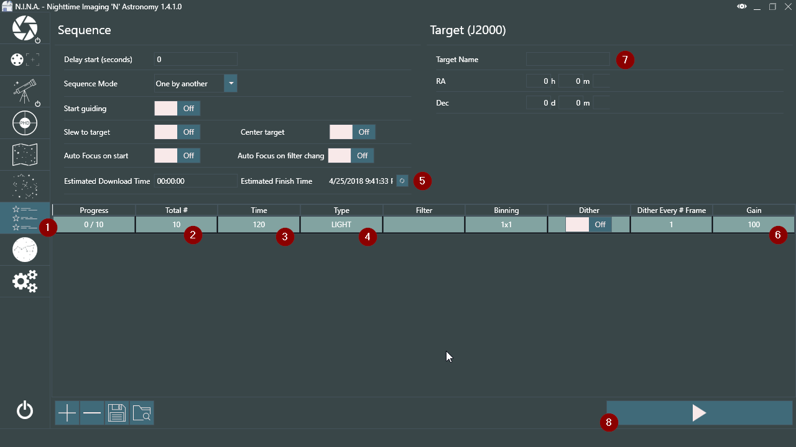
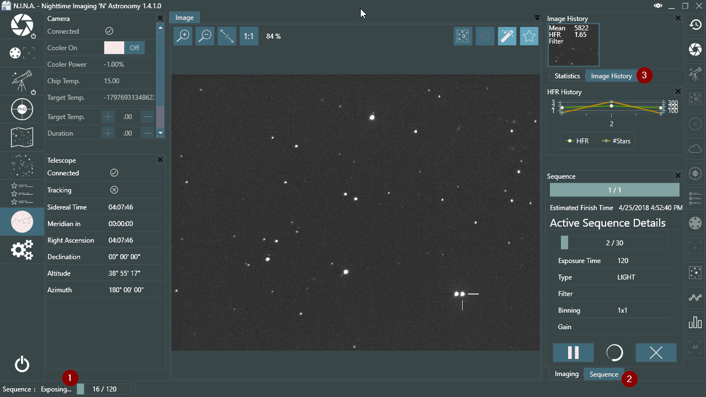

Once you nailed your focus you can switch to the Sequence tab (1).

Here we can find various options. For DSLR users it's a relatively simple matter; enter the amount of images you want to shoot in Total # (2), enter the time for a single image (3) and the type (4), which likely will be LIGHT at that point. The type is only used for the file name pattern that we set in the settings and display on the user interface in the imaging tab. You may also change your gain for the sequence in the Gain column (6).

With a press on the refresh estimated finish time button (5) you can see when the sequence is likely going to end. This value will change during the sequence depending on the average download time of your camera. Once you are satisfied with the sequence settings you can set a target name (7), which will be applied to the file name pattern as well. Finally press Start Sequence (8) to start the imaging sequence. From there on we will switch to the Imaging tab again (8).

Here you will see some small changes about the status of the sequence. At the bottom left (1) you see the current status of the camera which will change depending on what it is doing. In the sequence tab (2) you will see the estimated finish time and information about the image that is getting shot currently. You can also pause or cancel the sequence prematurely using the two buttons at the bottom of the sequence tab. Finally in the Image History (3) you will see the past images you shot and you can open them from there to review them. From here on it's waiting until the sequence completes.

Good luck and clear skies!