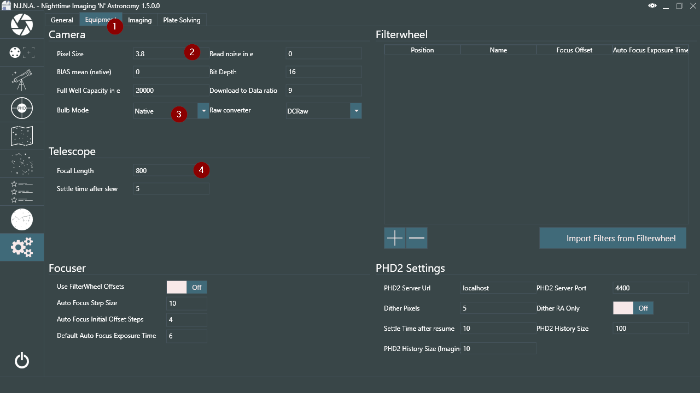
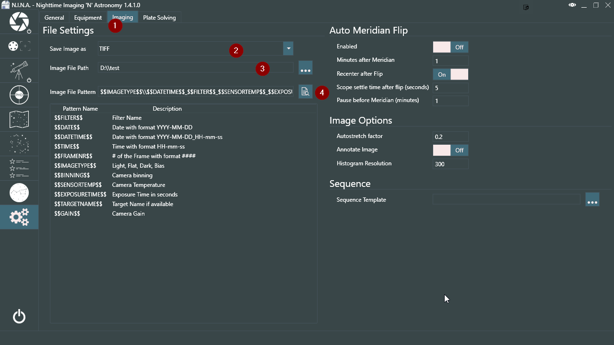

This whole setup routine only has to be done once for a specific profile. Once you have your default mount and camera set you just need to press the Connect button (7) once N.I.N.A. is started up to connect to the saved equipment automatically.

We have a few small steps to do before we can start with imaging. For that we need to switch to the Settings tab (8).

In the settings we go directly to the Equipment tab (1) and have to set a few things first. You should set your pixel size to the pixel size that your camera has, if it has not been set automatically, which is the case with most DSLR. Search online for the pixel size of your camera and enter the value in (2).

!!! tip
    If you have an older Nikon camera you might not be able to use the native bulb mode, controlled via USB, for exposures that are longer than 30 second. If you have a RS232 (serial) shutter cable or your mount has a canera shutter control port , change the **Bulb Mode** in (3). Please refer to the Advanced topic using RS232 or mount for bulb shutter.

Now we have to set a few other image saving related settings as well. To do that switch to the Imaging tab (1). The images can be saved as TIFF (with two different compression algorithms, too), XISF and FITS (2). TIFF is a solid format and this setting can be left unchanged. If you want to save space use a compressed TIFF format. Feel free to change it though should you prefer a different format. Next you need to set the Image File path (3). This is the place where your images will be saved. And finally, if you want you can change the Image File Pattern (4). This is how the images will be named after. You can see variables that you can use below the panel and with the button next to (4) you can check how your file pattern will look like. You can leave this setting on default or customize it as you like.

Once you have done that we can move on to to focusing and starting a sequence.