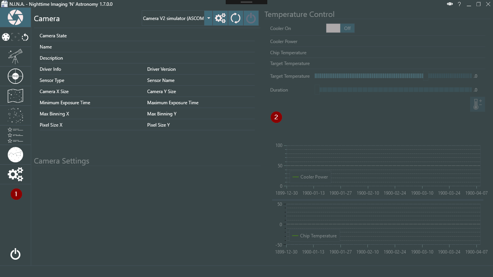

Once you start N.I.N.A. for the first time you will be greeted with this screen. Let's go over the basics for a moment to accustom you with the usage of this software.

The UI is divided in 2 panes. On the left side tabs section (1) you will find all the necessary tabs to connect your equipment, on the right side you usually find the detailed information about the currently selected tab. The currently selected tab is highlighted on the left side (1) so you always know where you are. Feel free to click through all of them; the detailed descriptions for all tabs are provided in the Tabs section. For now let's assume you have a DSLR camera and mount with no filter wheel or any extras and just want to start a simple sequence.

!!! note
    This Quick Start guide assumes you know how to connect your equipment to the computer and have the appropriate drivers for ASCOM and your camera (if necessary) already installed. If you do not, don't hesitate to ask us on the official N.I.N.A. Discord server.