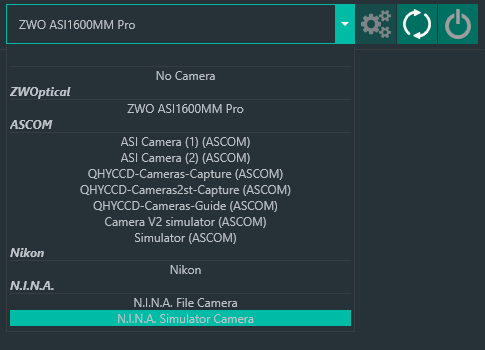
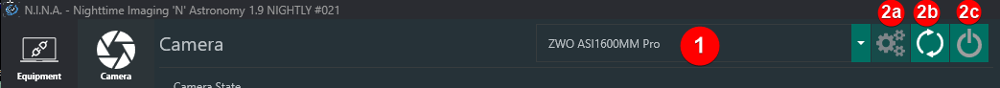

The Equipment tab is where one manages the the hardware that N.I.N.A. interacts with. The classes of hardware devices that N.I.N.A. supports are each their own sub-tab. Each sub-tab operates similarly.

## Selecting Equipment

Each tab has a drop-down box that lists the devices and drives that were detected. Devices are organized into categories to denote differences between Native, ASCOM, N.I.N.A. internal devices, and so-on.

In the above exmaple of a list of Cameras, the `ZWO ASI1600MM Pro` is listed under the `ZWOptical` category. You would select this device to connect to the camera directly. If connecting to the camera via ASCOM is desired, you would select the apprpriate `ASI Camera` driver in the `ASCOM` driver section. This is so it is clear *how* the device is accessed and operated.

## Management

Next to the drop-down box is a series of buttons:

1. The drop-down box that lists detected devices.
2. Buttons to the right of the drop-down box may be used to:
<ol type="a">
    <li>Configure the selected device or ASCOM driver</li>
    <li>Refresh the list of identified devices</li>
    <li>Connect to or disconnect from the selected device</li>
</ol>

!!! tip
    If you connect a device to your computer after starting N.I.N.A., you may press the Refresh button (2b) to have N.I.N.A. perform a system scan and update the list of devices.

## Information and Controls

Any device tab will also display information pertaining to the device that was selected and connected to. What information is displayed various among device types.

Devices might also display controls in the tab