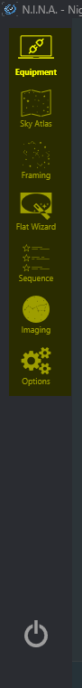

N.I.N.A. organizes different fuctional areas in its user interface into *tabs*. In some instances, a tab may be broken up into sub-tabs, such as in the Equipment tab, or into sub-windows, such as in Imaging tab.

The goal with tabs is to visually and functionally separate distinct areas of the application to avoid clutter. Descriptions of each tab and their constituent functions are in the following sections.

